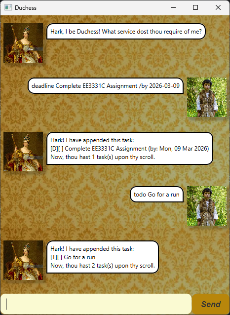

# Duchess User Guide

Duchess is a desktop app to help you **manage your tasks**.
Duchess can be used via a _Command Line Interface (CLI)_ or via a _Graphical User Interface (GUI)_.
Below is a user guide on how to use Duchess.

## Quick Start

1. Ensure you have Java `21` or above installed in your Computer.
2. Download the latest release from [here](https://github.com/Ianos828/ip/releases).
3. Copy the file to the folder you want to use as the home folder for Duchess.
4. Open a command terminal, `cd` into the folder you put the jar file in,
   and use the `java -jar duchess.jar` command to run the application.
   A GUI similar to the below should appear in a few seconds.

5. Type your command in the text box and press enter to execute it.
   Some examples of commands are:
    - `todo Go for a run`:   Creates a new task called `Go for a run`.
    - `list`:   Lists all tasks.
    - `delete 1`:   Deletes the first task in your list.
6. Refer to the [Features](#features) below for details of each command.

## Features

> **Notes about the command format:**
> - Words in `UPPER_CASE` are the parameters to be supplied by the user.\
  e.g. in `todo NAME`, `NAME` is a parameter which can be used as `todo Go for a run.`.
> - Aside from `NAME`, parameters can be in any order.\
  e.g. if the command specifies `/from START_DATE /to END_DATE`, `/to END_DATE /from START_DATE` is also acceptable.
> - Aside from `NAME`, if a parameter is expected only once in the command but multiple parameters are provided,\
  the last parameter will be taken.\
  e.g. `/by 2023-01-01 /by 2023-01-02` is taken as `/by 2023-01-02`.
> - Extraneous parameters for commands that do not take in parameters (such as `list`, `cheer` and `bye`) will be
  ignored.\
  e.g. if the command specifies `list 123`, it will be interpreted as `list`.
> - Duchess supports partial matching of commands for advanced users.\
  e.g. `ch`, `che` and `c` will all match the `cheer` command.

## Adding a task:
`todo`: Adds a new task to the list without any additional parameters.\
Format: `todo NAME`

`deadline`: Adds a new deadline to the list with a deadline date.\
Format: `deadline NAME /by END_DATE`

`event`: Adds a new event to the list with a start and end date.\
Format: `event NAME /from START_DATE /to END_DATE`

> **Some notes about the date format:**
> - Dates must be in the format `YYYY-MM-DD`.
> - Event `START_DATE` must occur before `END_DATE`.

## Deleting a task:
`delete`: Deletes a task from the list based on the specified task number.\
Format: `delete INDEX`

## Listing all tasks:
`list`: Lists all tasks in the list.\
Format: `list`

## Displaying a motivational quote:
`cheer`: Displays a motivational quote.\
Format: `cheer`

## Finding an outstanding task:
`outstanding`: Finds incomplete tasks at the specified date.\
Format: `outstanding DATE`

> **An outstanding task should:**
> - Be incomplete.
> - a `deadline` should end after `DATE`.
> - an `event` should start on/before `DATE` and end on/after `DATE`.
> - `todo` tasks are never considered outstanding.

## Finding a task by keyword:
`find`: Finds tasks based on the specified keyword. Duchess will do partial matching on the keyword.\
Format: `find KEYWORD`

## Displaying help:
`help`: Shows a list of available commands.\
Format: `help`

## Marking a task as completed:
`mark`: Marks a task as completed based on the specified task number.\
Format: `mark INDEX`

## Marking a task as incomplete:
`unmark`: Marks a task as incomplete based on the specified task number.\
Format: `unmark INDEX`

## Exiting the program:
`bye`: Exits the program.\
Format: `bye`

## Saving the data
Duchess saves your tasks in your hard disk automatically after any command that modifies your list.
There is no need to save manually.

## Editing the data file
Duchess saves your tasks as a `.txt` file `[JAR file location]/data/tasks.txt`. Advanced users are welcome to update
your tasks directly by editing that data file.

> **Caution:** While Duchess tries to load your data from the file, any data in the wrong format will be
ignored. This can lead to a loss of data!

# References
English Literature. (2025, July 23). _The 100 most famous quotes in english literature_. English Literature.
[https://englishliterature.in/the-100-most-famous-quotes-in-english-literature/](https://englishliterature.in/the-100-most-famous-quotes-in-english-literature/)

pictore. (2021, June 16). _Queen Victoria in her coronation in 1837 -xxxl with lots of details- stock illustration_
[Photograph]. iStock.
[https://www.istockphoto.com/en/vector/queen-victoria-in-her-coronation-in-1837-xxxl-with-lots-of-details-gm1323711024-409280322](https://englishliterature.in/the-100-most-famous-quotes-in-english-literature/)

SE-EDU. (2026, March 1). _JavaFX tutorial_. SE-EDU. [https://se-education.org/guides/tutorials/javaFx.html](https://englishliterature.in/the-100-most-famous-quotes-in-english-literature/)

Sunriseforever. (2021, May 10). _Boy, peasant child, fur vest image_ [Photograph]. Pixabay.
[https://pixabay.com/photos/boy-peasant-child-fur-vest-shirt-6240696/](https://englishliterature.in/the-100-most-famous-quotes-in-english-literature/)

titoOnz. (2017, July 4). _Gold damask pattern background stock photo_ [Photograph]. iStock.
[https://www.istockphoto.com/photo/gold-damask-pattern-background-gm809072960-130969091](https://englishliterature.in/the-100-most-famous-quotes-in-english-literature/)
